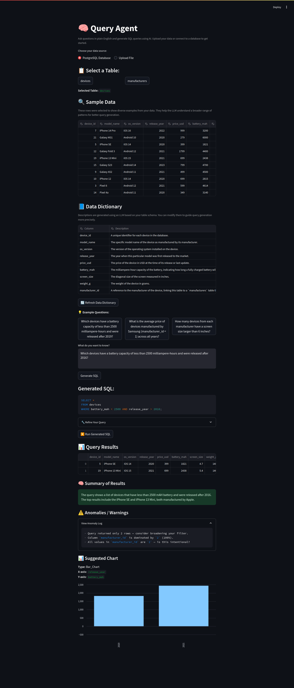

# InfoJOE

**InfoJOE** is an AI-powered natural language interface for PostgreSQL databases. It allows users to explore and query structured data using plain English, powered by [Qwen 2.5](https://huggingface.co/Qwen/Qwen1.5-72B-Chat) running via [LM Studio](https://lmstudio.ai/).

<details>
  <summary>Full Page Sample</summary>
  <br>
  <div align="center">
    
  </div>
</details>

---

## Getting Started

### Start the Application

Run the following command to build and start the containers:  

```docker compose up -d```

This will: 

1. Build the Docker images for the FastAPI and Streamlit services.  
2. Start the containers and serve the application.  

---

## Features

- **Auto Table Discovery**:  
   Automatically detects all tables in your connected PostgreSQL database.

- **Interactive Table Selection**:  
   Easily select tables using a click-to-select interface.

- **LLM-Generated Data Dictionary**:  
  Generates a clear, human-readable data dictionary for any selected table using Qwen 2.5.

- **Diverse Data Sampling**:  
  Previews a representative sample of rows to reflect different value distributions and data types, not just the top rows.

- **Natural Language to SQL**:  
  Translate natural language queries into SQL commands using Qwen 2.5.

---

## Prerequisites

Before you start, ensure the following tools are installed on your system:

- Docker  
- Docker Compose  

---

## Access the Application

- **FastAPI Backend**:  
  Visit <http://localhost:8000> to access the API.  
  Documentation is available at <http://localhost:8000/docs>  

- **Streamlit Frontend**:  
  Visit <http://localhost:8080> to interact with the frontend.  

---

## Development Workflow

### Stopping the Application

To stop the application, press `Ctrl+C` or run the following command:  

docker-compose down  

This will stop and remove the containers, but the built images will remain.  

---

## Directory Structure

The project structure is as follows:  

```shell
.  
├── backend/               # FastAPI application  
│   ├── db.py              # Handles database connection and queries (e.g., to PostgreSQL or SQLite)
│   ├── main.py            # FastAPI entrypoint  
│   ├── requirements.txt   # Python dependencies for FastAPI  
│   └── Dockerfile         # Dockerfile for FastAPI  
├── frontend/              # Streamlit application  
│   ├── app.py             # Streamlit entrypoint  
│   ├── Dockerfile         # Dockerfile for Streamlit
│   └── requirements.txt   # Python dependencies for streamlit  
├── postgres/              # PostgreSQL setup folder
│   └── init.sql           # SQL script to initialize the database (e.g., table creation, seed data)
├── shared_utils/          # Shared Python utilities used by both frontend and backend
│   └── functions.py       # Streamlit entrypoint  
├── docker-compose.yml     # Docker Compose configuration
└── README.md              # Project documentation  
```

---

## Troubleshooting

- Ensure Docker and Docker Compose are installed and running on your system.  
- Verify that the required ports (8000 and 8080) are not in use by other 
applications.  

---

## License

This project is licensed under the MIT License. See the LICENSE file for details.
